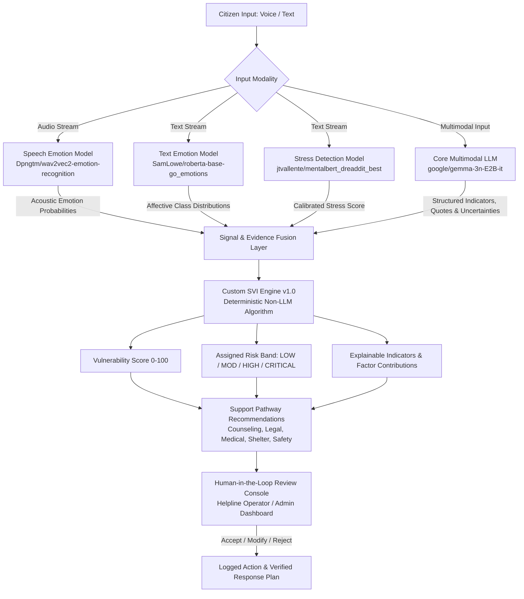
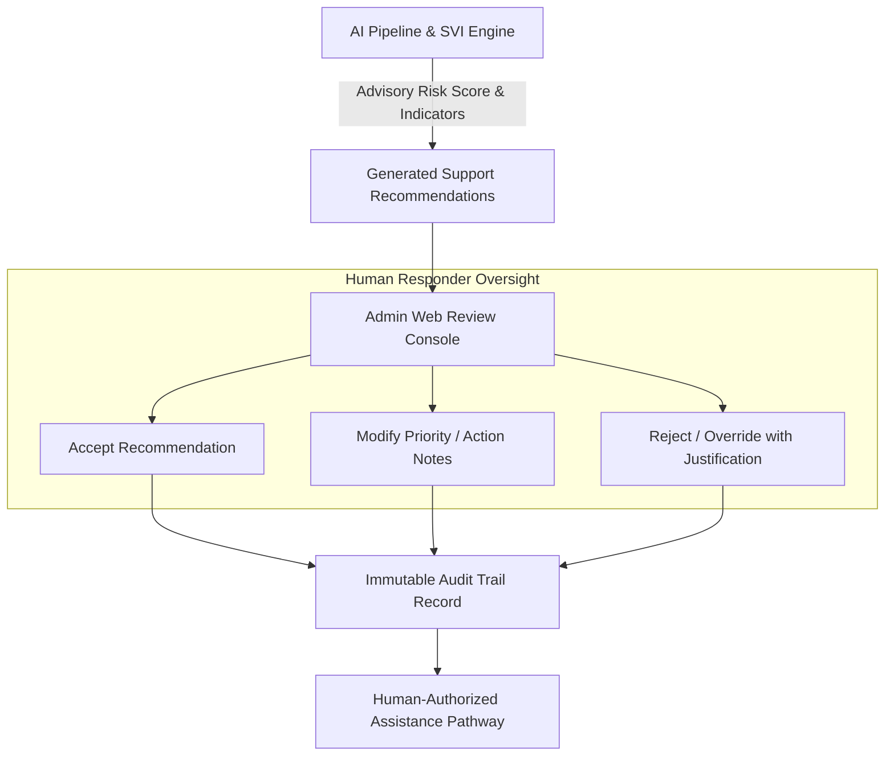

# SIH26093: AI-Assisted Real-Time Stress & Trauma Assessment Platform

> **SIH26093** — Real-Time Stress, Trauma, and Vulnerability Assessment Decision-Support System for Complainants and Responders Accessing the National Helpline Against Atrocities (NHAA 14566) and Integrated Emergency Portals.  
> *Smart India Hackathon 2026 — Theme: Smart Automation | Category: Software*

[](https://fastapi.tiangolo.com)
[](https://python.org)
[](https://flutter.dev)
[](https://www.postgresql.org)
[-blue)](backend/app/core/config.py)
[](#15-human-in-the-loop-architecture)

---

## 1. Project Title
**SIH26093: Real-Time Multimodal Stress & Vulnerability Assessment Module**

---

## 2. Short Project Description
SIH26093 is an AI-assisted trauma triage and decision-support module designed for public helpline operations, including the National Helpline Against Atrocities (NHAA 14566) and associated citizen distress intake portals. The system evaluates voice and textual inputs in real time to extract psychological distress signals, acoustic emotional cues, and structured clinical evidence. Rather than relying on opaque end-to-end score generation, the platform feeds extracted evidence into a transparent, deterministic mathematical risk engine (Custom SVI Engine v1.0) to compute a Stress Vulnerability Index (0–100) and actionable risk band, enabling human operators to triage cases rapidly, safely, and without autonomous high-stakes decision-making.

---

## 3. Problem Being Addressed
Citizens contacting distress hotlines and victim support services often experience extreme psychological stress, fear, and imminent threats. Helpline operators face systemic challenges:

1. **Cognitive Overload Under High Call Volume**: Responders must simultaneously de-escalate callers, record case histories, and determine risk levels, leading to human fatigue and variable triage quality.
2. **Subtle and Compound Signal Loss**: Distress signals—such as acoustic tremor, suppressed fear, latent panic, or indirect threat markers—can be difficult to systematically capture in fast-paced verbal or textual exchanges.
3. **Black-Box Automation Risks**: Conventional end-to-end deep learning or generative scoring systems output arbitrary, unexplainable numbers and risk hallucinations, making them unsafe for clinical and legal triage.
4. **Multilingual Context Preservation**: Complainants express distress naturally across regional languages and code-mixed inputs. Adding intermediary translation layers or disjoint transcription steps risks losing emotional nuance, sentiment fidelity, and dialectal meaning.
5. **Lack of Accountable Audit Trails**: Many helpline software solutions lack structured, immutable records linking extracted distress indicators to human operator decisions.

---

## 4. Solution Overview
SIH26093 solves these challenges through an explainable, bounded, **multimodal AI pipeline coupled with a deterministic risk scoring engine and human-in-the-loop governance**:

- **Multimodal Understanding Without Intermediate Translation**: Preserves raw language context directly using unified multimodal model understanding alongside dedicated acoustic and textual signal analyzers.
- **Dedicated Signal Extraction Models**: Runs speech emotion recognition directly on audio waveforms and granular text emotion/stress classifiers on textual inputs.
- **Structured Evidence Extraction**: Uses `google/gemma-3n-E2B-it` strictly to interpret context, extract verifiable indicators with verbatim evidence snippets, identify uncertainties, and produce empathetic conversational support.
- **Deterministic SVI Risk Engine v1.0**: Employs an open, inspectable mathematical formula to compute a 0–100 vulnerability score, factor contributions, and key risk drivers.
- **Non-Autonomous Decision Support**: Strictly forbids autonomous police dispatch, legal referrals, or psychiatric labeling. Human responders retain full oversight to accept, adjust, or override recommended support pathways.

---

## 5. Key Capabilities

| Capability | Technical Realization | Operational Impact |
| :--- | :--- | :--- |
| **Voice & Text Intake** | Native Flutter audio recording (16 kHz WAV) & multi-turn textual interface | Low-friction citizen reporting on Mobile (Android) and Web |
| **Direct Acoustic Emotion Analysis** | 7-class transformer-based speech emotion classification (`wav2vec2`) | Captures non-verbal vocal distress, tremor, panic, and agitation |
| **Granular Text Affect Detection** | 28-category textual emotion extraction (`roberta-base-go_emotions`) | Identifies nuanced feelings (grief, remorse, fear, anger, relief) |
| **Neural Stress Detection** | Domain-adapted MentalBERT classifier (`mentalbert_dreaddit_best`) | Delivers calibrated probability scores for acute psychological stress |
| **Contextual Evidence Synthesis** | Multimodal LLM reasoning (`google/gemma-3n-E2B-it`) | Extracts structured trauma indicators, safety concerns, and gaps |
| **Deterministic Risk Scoring** | Custom SVI Engine v1.0 with anti-double-counting and corroboration logic | Reproducible 0–100 index with clear point attribution |
| **Support Pathway Formulation** | Rule-driven recommendation generator across 7 civic/social categories | Pre-populates counseling, medical, legal, and shelter aid options |
| **Human Review Workflow** | Two-tier review console (Accept / Modify / Reject recommendations) | Ensures zero unauthorized automated dispatch or interventions |
| **Desktop-First Admin Console** | Responsive Web management dashboard with metrics, filters, and case viewer | Real-time case prioritization for helpline supervisors |
| **Strict 2-Role Security** | RBAC enforced via JWT claims & database constraints (`PEOPLE` vs `ADMIN`) | Strong data isolation and complainant privacy protection |

---

## 6. System Architecture

```mermaid
flowchart TB
    subgraph Client_Tier [Client Application Layer (Flutter)]
        User[Victim / Complainant] -->|Voice Stream / Text Input| FlutterClient[Flutter App: Android & Web]
        Responder[Helpline Admin / Responder] -->|Review & Action Console| AdminWeb[Admin Web Dashboard]
    end

    subgraph Gateway_Tier [Application & Security Gateway (FastAPI)]
        FlutterClient -->|REST API / Multipart 16kHz WAV| APIGateway[FastAPI Gateway /api/v1]
        AdminWeb -->|Authenticated JWT Requests| APIGateway
        APIGateway --> AuthGuard[Strict 2-Role RBAC: PEOPLE | ADMIN]
    end

    subgraph AI_Pipeline [AI / ML Signal Extraction Layer]
        APIGateway -->|Audio Waveform| SpeechEmotionModel[Speech Emotion: Wav2Vec2]
        APIGateway -->|Text Content| TextEmotionModel[Text Emotion: RoBERTa]
        APIGateway -->|Text Content| StressModel[Stress Detection: MentalBERT]
        APIGateway -->|Multimodal Context| CoreLLM[Core LLM: Gemma 3n E2B IT]
    end

    subgraph Synthesis_Tier [Evidence Synthesis & Risk Computation]
        CoreLLM -->|Structured Indicators & Evidence| EvidenceBundle[Structured Evidence Bundle]
        SpeechEmotionModel -->|Acoustic Signals| Fusion[Signal & Evidence Fusion]
        TextEmotionModel -->|Text Emotion Probabilities| Fusion
        StressModel -->|Stress Score| Fusion
        EvidenceBundle --> Fusion
        Fusion --> SVI_Engine[Custom SVI Engine v1.0\nDeterministic Non-LLM Algorithm]
        SVI_Engine --> RiskOutput[0-100 SVI Score & Risk Band\nLOW / MODERATE / HIGH / CRITICAL]
    end

    subgraph Decision_Tier [Human-in-the-Loop Decision Support]
        RiskOutput --> RecEngine[Support Pathway Recommendation Engine]
        RecEngine --> AdminWeb
        AdminWeb -->|Human Decision: Accept / Modify / Reject| CaseResolution[Verified Action Plan]
    end

    subgraph Storage_Tier [Persistence Layer]
        AuthGuard --> DB[(PostgreSQL 18\nCases, Sessions, Recommendations, Audit Trail)]
        CaseResolution --> DB
    end
```

---

## 7. AI/ML Model Stack

The locked AI stack operates without external cloud API dependencies, ensuring reliable local/private deployment:

| Component | Model Identifier | Role | Input Modality |
| :--- | :--- | :--- | :--- |
| **Speech Emotion Recognition** | `Dpngtm/wav2vec2-emotion-recognition` | Extract acoustic emotional signals directly from speech waveforms | Raw Audio (16 kHz WAV) |
| **Text Emotion Recognition** | `SamLowe/roberta-base-go_emotions` | Detect granular affective states from complainant textual input | Text Tokens |
| **Stress Detection** | `jtvallente/mentalbert_dreaddit_best` | Detect acute psychological stress signals | Text Tokens |
| **Core Multimodal LLM** | `google/gemma-3n-E2B-it` | Conversation understanding, multimodal context interpretation, structured evidence extraction, and empathetic response generation | Text & Multimodal Prompts |
| **Risk Engine** | `Custom SVI Engine v1.0` | Deterministic mathematical scoring, risk tiering, and explainable indicator attribution | Fused Signals & Evidence Objects |

> [!IMPORTANT]
> **No Separate ASR or Translation Models**: The architecture intentionally excludes separate speech-to-text (ASR), translation, Tamil-specific translation, or external reasoning LLMs. This preserves native linguistic context and avoids propagation of translation or transcription errors into downstream safety scoring.

---

## 8. Model Responsibilities

### 1. Speech Emotion Recognition (`Dpngtm/wav2vec2-emotion-recognition`)
- Processes raw 16 kHz audio waveforms directly via transformer temporal convolutional networks.
- Classifies acoustic features into 7 discrete emotional states: *anger, disgust, fear, joy, neutral, sadness, surprise*.
- Detects vocal prosody, pitch instability, and tremor independently of spoken lexicon.

### 2. Text Emotion Recognition (`SamLowe/roberta-base-go_emotions`)
- Performs multi-label affective classification across 28 GoEmotions categories (e.g., *nervousness, grief, fear, remorse, relief*).
- Supplies probability distributions that corroborate or contrast with speech emotion outputs.

### 3. Stress Detection (`jtvallente/mentalbert_dreaddit_best`)
- Leverages domain-adapted MentalBERT trained on distress and trauma discourse (Dreaddit benchmark).
- Generates a calibrated stress score ($0.0 \to 1.0$) indicating urgency and psychological overwhelm.

### 4. Core Multimodal LLM (`google/gemma-3n-E2B-it`)
- **Conversational Understanding**: Engages the complainant with context-aware, empathetic guidance.
- **Multimodal Context Interpretation**: Interprets compound inputs in their original context.
- **Structured Evidence Extraction**: Outputs typed JSON objects adhering to strict Pydantic schemas (indicators, confidence levels, direct quotes, and uncertainties).
- **Zero Numerical Risk Scoring**: Does **not** compute numerical risk scores, preventing hallucinated triage ratings.

---

## 9. SVI Risk Engine (Custom SVI Engine v1.0)

The **Stress Vulnerability Index (SVI)** is a **deterministic, explainable mathematical algorithm**—not an AI/black-box model.

```
+-------------------------------------------------------------------------+
|                       Custom SVI Engine v1.0                            |
|                                                                         |
|   SVI = min( 100.0,  Sum(w_i * p_i * c_i * s_i) * Corroboration )       |
|                                                                         |
|   w_i = Factor Base Weight       p_i = Presence Multiplier [0.0 - 1.0]  |
|   c_i = Signal Confidence        s_i = Evidence Strength [0.5 - 1.0]    |
|   Corroboration Bonus = 1.15x (multi-source confirmation)               |
+-------------------------------------------------------------------------+
```

### Core Characteristics:
1. **Deterministic & Reproducible**: Given identical input indicators and confidence values, the engine always produces the exact same score.
2. **Confidence-Aware**: Scales each vulnerability factor by the model's extraction confidence ($c_i$) and empirical presence state ($p_i$).
3. **Anti-Double Counting & Deduplication**: Deduplicates overlapping text quotes within the same factor group so repetitive phrasing does not artificially inflate risk.
4. **Cross-Modal Corroboration**: Applies a bounded multiplier ($1.15\times$) only when evidence is independently confirmed across distinct modalities (e.g., speech acoustics + text classification).
5. **Full Explainability**: Deconstructs the final score into exact point contributions for top driving factors.

### Scoring Bands & Operational Protocols:
| Risk Tier | SVI Score Range | Operational Definition | Protocol |
| :---: | :---: | :--- | :--- |
| **LOW** | `0.0 – 29.9` | Routine grievance or informational inquiry | Standard informational guidance & resources |
| **MODERATE** | `30.0 – 59.9` | Noticeable emotional strain, economic pressure, or relational friction | Counselor callback & community resource navigation |
| **HIGH** | `60.0 – 84.9` | Substantial coercion, threats, or severe distress | Priority responder review; legal & psychological aid |
| **CRITICAL** | `85.0 – 100.0` | Imminent physical danger, active violence, or acute crisis | Immediate live responder escalation & safety verification |

---

## 10. End-to-End AI Flow



---

## 11. Technology Stack

### Frontend
- **Framework**: Flutter 3.13+ (Dart SDK `^3.13.3`)
- **Supported Platforms**: Responsive Web (Desktop-first Admin Console) & Android Mobile Client
- **State & Routing**: `go_router` (`^15.1.2`), `shared_preferences` (`^2.5.5`)
- **Audio Capture**: `record` (`^7.1.1`) configured for standard 16 kHz PCM WAV capture

### Backend
- **Framework**: Python 3.10–3.12 with FastAPI (`>=0.115.0`) & Uvicorn (`>=0.30.0`)
- **Data Validation**: Pydantic v2 (`>=2.8.0`)
- **Async Runtime**: AnyIO / asyncio event loop policy with Windows compatibility layer
- **HTTP Client**: HTTPX (`>=0.27.0`)

### Database & Authentication
- **Primary Database**: PostgreSQL 18 with `psycopg 3` (`postgresql+psycopg://...`)
- **Local Fallback**: SQLite compatibility mode (`responder.db`) for rapid local development
- **Migrations**: Alembic (`>=1.13.0`)
- **Authentication**: JWT (HS256) with strict 2-role RBAC (`PEOPLE` and `ADMIN`) + Supabase Auth client integration

### AI / ML Runtime & Inference
- **Inference Backends**: PyTorch (`>=2.0.0`), Torchaudio (`>=2.0.0`), Hugging Face Transformers (`>=4.40.0`), ONNX Runtime (`>=1.20.0`)
- **LLM Runtime**: Local Gemma inference runtime via Ollama (`gemma3:12b` / `google/gemma-3n-E2B-it`) with strict fallback guards

---

## 12. Data Pipeline

The project follows a secure, privacy-first data pipeline designed for consented citizen data:


### Pipeline Stages:
1. **Consented Collection**: Data collected strictly with explicit consent and immediate PII scrubbing.
2. **Quality Filtering**: Automatic acoustic verification (clipping detection, SNR thresholding, sample rate validation).
3. **Clinical / Trauma Annotation**: Multi-annotator labeling for emotional valence, stress presence, and crisis indicators.
4. **Versioning & Traceability**: Versioned dataset partitions (Train / Val / Held-Out Test) preventing benchmark leakage.
5. **Controlled Integration**: Adapter checkpoints must pass automated validation benchmarks before promotion to production.

---

## 13. Model Evaluation Strategy

### Voice Data Evaluation
Recorded voice inputs are evaluated across technical and operational dimensions:
- **Speech Emotion Performance**: Class-wise macro-F1 score across high-arousal (anger, fear) and low-arousal (sadness, neutral) states.
- **Audio Quality & Robustness**: Performance degradation testing under varying signal-to-noise ratios (SNR), background street noise, and low-cost microphone distortion.
- **Inference Latency**: Round-trip processing benchmarks targeting $<400\text{ ms}$ for audio feature extraction.
- **Model Confidence Calibration**: Expected Calibration Error (ECE) to prevent overconfident acoustic predictions.

### Text & Stress Evaluation
- **Text Emotion (GoEmotions)**: Multi-label ROC-AUC, Precision, and Recall across 28 affective dimensions.
- **Stress Detection (MentalBERT)**: Binary classification F1-score on held-out Dreaddit test splits, cross-validated against domain distress benchmarks.
- **LLM Structured Extraction**: Schema conformance validation (100% valid Pydantic JSON compliance), hallucination rate monitoring, and grounding verification against input quotes.

---

## 14. Training & Fine-Tuning Strategy

```
+--------------------------------------------------------------------------+
| Status: Baseline Foundation Models Locked; Domain Fine-Tuning Planned   |
+--------------------------------------------------------------------------+
```

### Current Status vs. Planned Work:
- **Current Baseline (Implemented)**: The platform executes zero-shot and transfer-learning inference using the locked foundation checkpoints (`wav2vec2-emotion-recognition`, `roberta-base-go_emotions`, `mentalbert_dreaddit_best`, and `gemma-3n-E2B-it`).
- **Planned Fine-Tuning Approach (PEFT / QLoRA)**:
  - **Parameter-Efficient Fine-Tuning (PEFT)**: Employing **QLoRA** (Quantized Low-Rank Adaptation) on `google/gemma-3n-E2B-it` to adapt the core LLM to Indian emergency helpline discourse without retraining base weights.
  - **Supervised Fine-Tuning (SFT)**: Target training objective optimizing instruction following for structured evidence extraction schemas and empathy-calibrated safety responses.
  - **Domain Adapter Weights**: Low-rank adapter matrices ($r=16$, $\alpha=32$) trained on verified, consented bilingual distress dialogs.

---

## 15. Human-in-the-Loop Architecture

The platform operates on a strict **Decision-Support Paradigm**. The AI pipeline produces observations; human operators make decisions.



### Strict Non-Autonomous Boundaries:
- ❌ **No Automated Police Dispatch**: The system will never trigger police, legal, or emergency vehicle dispatch autonomously.
- ❌ **No Autonomous Psychiatric / Medical Diagnosis**: Indicators are labeled as operational decision-support observations only.
- ❌ **No Automated Contacting of Relatives or Third Parties**: Complainant autonomy and confidentiality remain preserved.
- ✅ **Mandatory Human Verification**: All emergency safety flags require explicit confirmation by an authenticated administrator.

---

## 16. Project Structure

```
sih26093/
├── backend/                        # FastAPI Backend Application
│   ├── alembic/                    # Database schema migration versions
│   ├── app/
│   │   ├── api/                    # REST API routing layer
│   │   │   └── routes/             # Versioned API routes (auth, sessions, cases, svi, etc.)
│   │   ├── core/                   # Core application configuration & security
│   │   ├── db/                     # Database models, schemas, and session managers
│   │   ├── schemas/                # Pydantic data schemas and contracts
│   │   └── services/               # Business logic & AI model adapters
│   │       ├── emotion/            # Speech & Text emotion inference services
│   │       ├── stress/             # MentalBERT stress classification service
│   │       ├── llm/                # Gemma LLM client, schemas & prompt guards
│   │       ├── svi/                # Deterministic Custom SVI Engine v1.0
│   │       ├── recommendation/     # Support pathway generation engine
│   │       └── session_service.py  # Session lifecycle & multimodal orchestration
│   ├── tests/                      # Pytest comprehensive test suite (140+ tests)
│   ├── requirements.txt            # Python backend dependencies
│   └── run_server.py               # Backend startup script
├── lib/                            # Flutter Frontend Application
│   ├── core/                       # Core styles, themes, and API clients
│   ├── features/
│   │   ├── auth/                   # Authentication (Login, Register, Role Guards)
│   │   ├── victim/                 # Complainant interface (Chat, Voice Recorder, Intake)
│   │   └── responder/              # Admin/Responder console (Web Dashboard, Case Details)
│   ├── shared/                     # Shared UI components & widgets
│   └── main.dart                   # Flutter application entry point
├── test/                           # Flutter unit & widget test suite (34+ tests)
├── assets/                         # Application branding assets & icons
├── docs/                           # Architecture documentation & specifications
├── pubspec.yaml                    # Flutter project configuration & dependencies
├── run_backend.bat                 # Windows batch launcher for backend
├── run_backend.ps1                 # PowerShell launcher for backend
└── README.md                       # Project documentation
```

---

## 17. Development Status

| Component | Status | Implementation Details |
| :--- | :---: | :--- |
| **FastAPI REST API Gateway** | ✅ **Implemented** | Complete routes for auth, sessions, assessment, cases, svi, and admin |
| **Speech Emotion Model Adapter** | ✅ **Implemented** | `Dpngtm/wav2vec2-emotion-recognition` adapter with fallback guards |
| **Text Emotion Model Adapter** | ✅ **Implemented** | `SamLowe/roberta-base-go_emotions` 28-class inference adapter |
| **Stress Detection Adapter** | ✅ **Implemented** | `jtvallente/mentalbert_dreaddit_best` neural classifier |
| **Gemma 3n Multimodal Service** | ✅ **Implemented** | Structured evidence extraction schema, prompt guards & policy filters |
| **Custom SVI Engine v1.0** | ✅ **Implemented** | Deterministic mathematical scoring with factor attribution and risk bands |
| **Support Recommendation Engine** | ✅ **Implemented** | Rule-driven recommendation generation across 7 support categories |
| **Strict 2-Role RBAC** | ✅ **Implemented** | `PEOPLE` and `ADMIN` role boundaries enforced via JWT & DB policies |
| **Flutter Mobile Client (Android)** | ✅ **Implemented** | Complainant intake, voice recording (16 kHz WAV), and chat UI |
| **Flutter Admin Web Dashboard** | ✅ **Implemented** | Desktop-first triage console with metrics, case views, and human review |
| **Automated Test Suites** | ✅ **Implemented** | 140+ backend pytest tests and 34+ Flutter widget/integration tests |
| **Domain QLoRA Fine-Tuning** | 🔄 **Planned** | Parameter-efficient fine-tuning on consented bilingual helpline data |
| **Edge Quantization & Packaging** | 🔄 **Planned** | GGUF / ONNX INT8 quantization for resource-constrained edge deployments |

---

## 18. Future Roadmap

1. **Phase 1: Consented Domain SFT / QLoRA Training**
   - Fine-tune `google/gemma-3n-E2B-it` using QLoRA on curated, de-identified emergency helpline dialogues.
   - Refine extraction accuracy for regional dialectal nuances and informal distress expressions.

2. **Phase 2: Edge-Optimized Deployment**
   - Package speech emotion and stress models using ONNX Runtime with INT8 quantization for low-latency edge deployment.
   - Benchmark GGUF quantized weights for local LLM inference on standard workstation hardware without discrete GPUs.

3. **Phase 3: Integration with National Helpline Infrastructure**
   - Integrate with Computer-Aided Dispatch (CAD) systems as an auxiliary, advisory telemetry stream.
   - Expand multi-agency referral pathways (DLSA, Sakhi One Stop Centers, Swadhar Greh).

---

## 19. Setup & Installation Instructions

The codebase is fully functional and ready to run locally:

### Prerequisites
- **Python**: 3.10, 3.11, or 3.12
- **Flutter**: 3.13+ with Dart SDK
- **Database**: PostgreSQL 18 (or local SQLite auto-fallback)
- **Optional (for Local Gemma LLM)**: Ollama running `gemma3:12b` or configured remote endpoint

---

### Step 1: Backend Setup
```bash
# Navigate to backend directory
cd backend

# Create and activate a virtual environment
python -m venv venv
# On Windows:
.\venv\Scripts\activate
# On Linux/macOS:
# source venv/bin/activate

# Install dependencies
pip install -r requirements.txt

# Configure environment variables (copy and edit sample)
cp .env.example .env

# Run database migrations (optional, SQLite/Postgres auto-initializes)
alembic upgrade head

# Start the FastAPI development server
uvicorn app.main:app --host 0.0.0.0 --port 8000 --reload
```
*The interactive Swagger API documentation is available at `http://localhost:8000/docs`.*

---

### Step 2: Running Backend Tests
```bash
cd backend
pytest tests/ -v
```

---

### Step 3: Frontend Setup (Flutter)
```bash
# From the project root
flutter pub get

# Run Flutter static analysis
flutter analyze

# Run Flutter test suite
flutter test

# Run Web Dashboard (Desktop Chrome)
flutter run -d chrome

# Run on Android Emulator / Physical Device
flutter run -d android
```

---

## 20. Disclaimer & Responsible AI Considerations

> [!WARNING]
> ### Critical Operational & Ethical Disclaimer
> - **Decision Support Only**: SIH26093 is an engineering decision-support tool. It is **not** a diagnostic medical device, psychiatric assessment tool, or judicial verdict generator.
> - **Zero Autonomous Interventions**: The platform will never autonomously dispatch police, emergency medical services, or legal summons. All recommendations require verified human review and authorization.
> - **Non-Clinical Risk Bands**: SVI scores (0–100) and risk categories (`LOW`, `MODERATE`, `HIGH`, `CRITICAL`) are triage rubrics designed to assist human operators in managing response queues during operational distress calls; they do not represent clinical diagnoses.
> - **Data Privacy & Protection**: Complainant interactions are protected under role-based access control (RBAC). Identifiable voice and text data must be handled in compliance with applicable data protection standards.
