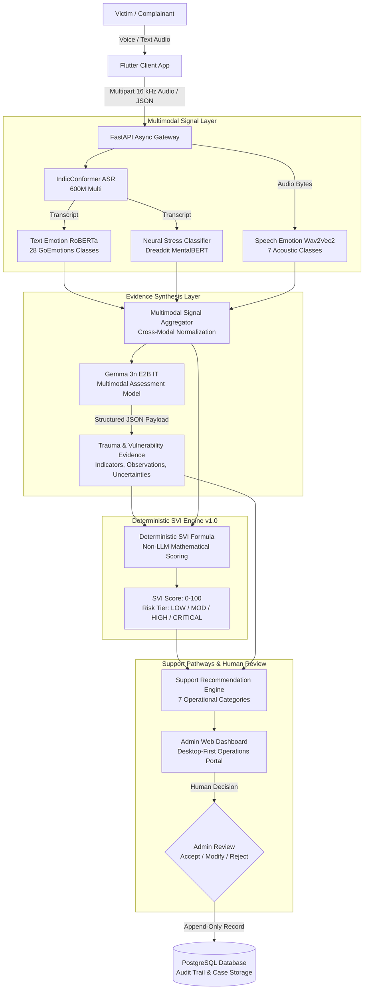
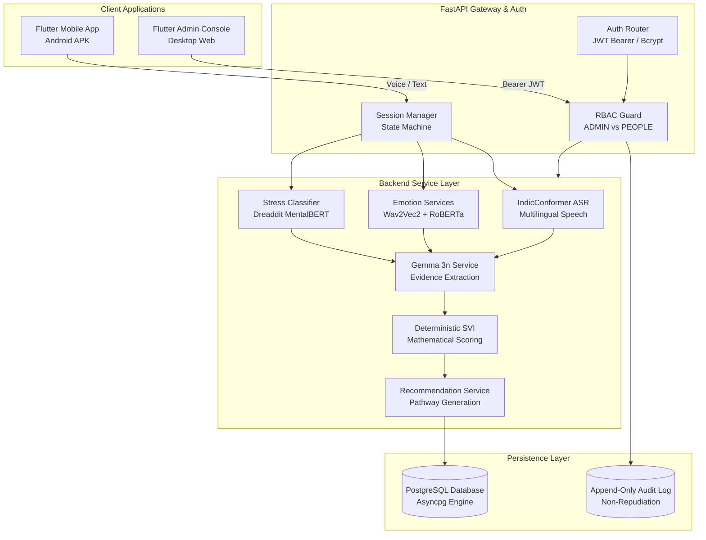

# AI-Assisted Stress & Trauma Vulnerability Assessment

> **SIH26093** — AI-Based Real-Time Stress and Trauma Assessment Module for Victims/Complainants Accessing NHAA (14566) and Integrated Portal  
> *Smart India Hackathon 2026 — Theme: Smart Automation | Category: Software*

[](https://fastapi.tiangolo.com)
[](https://python.org)
[](https://flutter.dev)
[](backend/tests)
[](test)
[](lib)
[](docs/security.md)

---

## 1. Executive Summary

The **SIH26093** module is an AI-assisted trauma triage and decision-support platform engineered for the **National Helpline Against Atrocities (NHAA 14566)** and integrated emergency portals. The system provides real-time, explainable triage signals to human administrators handling distressed complainants across India without making autonomous legal, medical, or dispatch decisions.

The architecture integrates Indian multilingual automatic speech recognition (IndicConformer), acoustic and textual emotion analysis, neural stress detection, multimodal LLM assessment evidence extraction (Gemma 3n E2B IT), a deterministic Stress Vulnerability Index (SVI v1.0), support recommendation workflows, an immutable append-only audit trail, and a desktop-first responsive Admin Web Dashboard.

---

## 2. Problem Statement

Complainants reaching out to emergency hotlines and victim support portals often communicate under extreme emotional distress, acute fear, or immediate danger across diverse Indian regional languages. Traditional helpline workflows face critical challenges:
1. **Unsystematic Signal Capture**: Important behavioral cues—such as pitch instability, acoustic tremor, sustained emotional distress, and indirect threats—can be overlooked during rapid manual intake.
2. **Multilingual Disparities**: India's linguistic diversity requires robust speech recognition across official regional languages, dialectal variations, and code-mixed inputs.
3. **Opaque Automation Risks**: Generic "black-box" AI systems that output arbitrary risk scores or attempt autonomous dispatch create unacceptable legal, ethical, and clinical hazards.
4. **Responder Cognitive Overload**: Human responders require structured, transparent, and corroborated evidence to quickly prioritize cases, verify safety flags, and coordinate appropriate multi-pathway support.

---

## 3. The Proposed Solution

SIH26093 resolves these challenges through a **strictly bounded, explainable, human-in-the-loop architecture**:



---

## 4. Key Implemented Features

- **Multilingual Voice Intake**: Native Flutter audio recording with 16 kHz WAV encoding, real-time waveform visualization, and IndicConformer transcription.
- **Acoustic Emotion Recognition**: Wav2Vec2 transformer-based analysis classifying speech into 7 primary acoustic emotion states.
- **Text Emotion Recognition**: RoBERTa fine-tuned on GoEmotions extracting 28 granular affective categories.
- **Neural Stress Classifier**: MentalBERT architecture fine-tuned on Dreaddit providing calibrated stress probability.
- **Multimodal LLM Evidence Reasoning**: Gemma 3n E2B IT structured extraction of clinical indicators, safety concerns, and uncertainties (without generating arbitrary scores).
- **Deterministic SVI Engine (v1.0)**: Transparent, reproducible mathematical formula computing a 0–100 vulnerability index with factor contributions and key drivers.
- **Support Pathway Recommendations**: Structured recommendations across 7 support categories with priority, evidence sources, and suggested responder actions.
- **Human-in-the-Loop Decision Console**: Full human review workflow (Accept, Modify priority/action/note, Reject) without overwriting original AI suggestions.
- **Desktop-First Admin Web Dashboard**: Operational console featuring summary metric cards, risk distribution visibility, "Requires Attention" safety triage, case management tables, and full case detail inspectors.
- **Strict Two-Role RBAC**: Exactly two roles (`PEOPLE` and `ADMIN`) enforced at the database, JWT claim, and API gateway levels.
- **Append-Only Audit Trail**: Immutable logging of all authentication events, case status transitions, and recommendation reviews without storing raw victim conversations in audit logs.
- **Synthetic SIH Demonstration Suite**: Pre-seeded with 5 comprehensive demonstration cases (Cases A–E) illustrating all risk categories and language interactions.

---

## 5. Locked AI Model Pipeline

The machine learning pipeline uses dedicated, locked models evaluated for the Indian public-safety domain. **No external cloud APIs or substitute models (such as Faster-Whisper) are used.**

| Pipeline Component | Locked Model / Architecture | Parameter Size | Target Task & Domain |
| :--- | :--- | :--- | :--- |
| **Speech-to-Text (ASR)** | `ai4bharat/indic-conformer-600m-multilingual` | 600M | Indian multilingual speech recognition (22 languages; CTC & RNNT decoders) |
| **Speech Emotion Recognition** | `Dpngtm/wav2vec2-emotion-recognition` | 317M | Acoustic prosody & emotion extraction (7 classes: anger, disgust, fear, joy, neutral, sadness, surprise) |
| **Text Emotion Recognition** | `SamLowe/roberta-base-go_emotions` | 125M | Granular textual affective classification (28 GoEmotions categories) |
| **Stress Detection** | `jtvallente/mentalbert_dreaddit_best` | 110M | Domain-adapted transformer for psychological stress indicators |
| **Multimodal Assessment** | `google/gemma-3n-E2B-it` | 3B | Structured trauma evidence synthesis, indicator extraction, and uncertainty identification |
| **Triage Index (SVI)** | `Deterministic Custom Engine v1.0` | N/A | Deterministic, explainable mathematical scoring (0–100 score & risk band assignment) |

---

## 6. Multimodal Assessment Architecture

The system enforces strict architectural boundaries between signal extraction, evidence synthesis, and risk score calculation:

1. **Signal Aggregation**: Acoustic emotion distributions, text emotion probabilities, stress confidence, and IndicConformer transcripts are aligned by timestamp into an immutable `MultimodalSessionState`.
2. **Structured LLM Evidence Synthesis**: `google/gemma-3n-E2B-it` evaluates the aligned session state against a structured clinical prompt. It outputs a validated Pydantic schema containing:
   - `clinical_summary`: Concise summary of distress context.
   - `indicators`: List of extracted indicators with category, confidence rating, and evidence quotes.
   - `uncertainties`: Documented gaps in information (e.g., unknown current location, ambiguous safety status).
   - `safety_concerns`: Explicit immediate danger flags.
3. **Strict Separation of Concerns**: **Gemma does NOT directly calculate the SVI score.** The LLM functions exclusively as a structured evidence extractor; score computation is handed off to the deterministic mathematical engine.

---

## 7. Trauma & Vulnerability Indicators

The module extracts specific, actionable indicators for responder consideration:

- **Emotional Distress & Despair**: Severe acute anxiety, crying, emotional breakdown, hopelessness.
- **Fear & Intimidation**: Coercive control, physical threats, harassment, stalking.
- **Domestic & Relational Abuse**: Spousal violence, in-law harassment, child safety concerns.
- **Shelter & Economic Insecurity**: Imminent eviction, homelessness risk, financial abandonment.
- **Immediate Physical Danger**: Active intruder, ongoing assault, life-threatening crisis.
- **Crisis & Self-Harm Indicators**: Expressions of self-harm or acute suicidality requiring immediate human escalation.
- **Communication Difficulty**: Language barriers, dysfluency, or cognitive overwhelm (guarded so communication difficulty alone does not escalate trauma scores).

> [!NOTE]
> All extracted indicators are advisory decision-support signals. The system explicitly does **not** make psychological or psychiatric diagnoses.

---

## 8. Deterministic Stress Vulnerability Index (SVI v1.0)

The **Stress Vulnerability Index (SVI)** is a reproducible mathematical metric ranging from **0.0 to 100.0**.

### Formula Architecture
$$	ext{SVI} = \min\left(100.0, \, \Big(\sum w_i \cdot c_i \cdot s_i\Big) + \Delta_{	ext{corroboration}} - \Delta_{	ext{uncertainty}} - \Delta_{	ext{redundancy}}
ight)$$

- **Weighted Factor Contributions ($w_i \cdot c_i \cdot s_i$)**: Factors include threat severity, domestic abuse, shelter vulnerability, emotional distress, and acoustic stress.
- **Cross-Modal Corroboration ($\Delta_{	ext{corroboration}}$)**: Additive bonus when acoustic emotion matches textual distress markers.
- **Uncertainty Penalty ($\Delta_{	ext{uncertainty}}$)**: Discount applied when critical information is missing, preventing overconfident escalation.
- **Redundancy Discount ($\Delta_{	ext{redundancy}}$)**: Anti-double-counting filter that discounts repeated mentions of identical evidence.

### Operational Risk Bands
| Risk Category | Score Range | Operational Definition | Protocol |
| :---: | :---: | :--- | :--- |
| **LOW** | 0.0 – 29.9 | Baseline procedural inquiries or routine grievances | Standard information dissemination |
| **MODERATE** | 30.0 – 59.9 | Elevated emotional friction, social isolation, relocation stress | Community navigation & counselor callback |
| **HIGH** | 60.0 – 79.9 | Severe coercion, harassment, threatened eviction with minors | Priority human review & multi-pathway legal/social aid |
| **CRITICAL** | 80.0 – 100.0 | Active physical danger, forced entry, life safety threats | Immediate emergency desk escalation for human action |

> [!WARNING]
> Risk bands are engineering triage thresholds configured for operational prioritizing during hackathon evaluation. They do not constitute clinical validation.

---

## 9. Support Recommendation Engine

The engine converts corroborated evidence and SVI tiers into appropriate support pathways:

1. **Psychological First Aid / Counseling Support**: Tele-counseling with regional-language trauma specialists.
2. **Legal Aid**: Panel advocate referral through District Legal Services Authorities (DLSA).
3. **Medical Assistance**: Coordination with Sakhi One Stop Centers (OSC) or district health facilities.
4. **Safety Assistance**: Escort coordination and safety planning.
5. **Police Assistance (Human Escalation Only)**: Advisory referral to emergency desks for verified threats.
6. **Emergency Shelter Accommodation**: Swadhar Greh or short-stay shelter placement coordination.
7. **Social Welfare Support**: Documentation and victim compensation scheme guidance.

### Non-Autonomous Guardrail
The system **NEVER** autonomously:
- Contacts the police or local law enforcement
- Dispatches PCR emergency vehicles
- Contacts victim family members or employers
- Issues legally binding directives or medical prescriptions

All recommendations are advisory. Every action requires human review and confirmation.

---

## 10. Human-in-the-Loop Governance

```
      AI Signal Extraction ──► Gemma Assessment ──► Deterministic SVI ──► Recommendations
                                                                                │
                                                                                ▼
      Audit Trail  ◄─── PostgreSQL ◄─── Human Decision ◄─── Admin Web Console Review
                                      (Accept / Modify / Reject)
```

- **ACCEPT**: Approves the recommended pathway and moves the case to `AWAITING_RESPONDER_ACTION`.
- **MODIFY**: Allows the administrator to adjust the priority tier, edit the operational action, and record an explanatory note. The original AI recommendation remains preserved.
- **REJECT**: Records the rejection justification and archives the recommendation.

---

## 11. Role-Based Access Control (RBAC)

The system enforces a **strict two-role model**:

```
                              ┌───────────────────────────┐
                              │     AUTHENTICATED USER    │
                              └─────────────┬─────────────┘
                                            │
                        ┌───────────────────┴───────────────────┐
                        ▼                                       ▼
             Role: "PEOPLE"                          Role: "ADMIN"
     ┌───────────────────────────────┐       ┌───────────────────────────────┐
     │ - Victim intake flow          │       │ - Full operations dashboard   │
     │ - Own session interactions    │       │ - System-wide case queue      │
     │ - Audio voice transcription   │       │ - Case detail & SVI inspector │
     │ - Multi-turn chat guidance    │       │ - Recommendation review       │
     │                               │       │ - System-wide audit logs      │
     │ ❌ Denied admin endpoints     │       │ - Lifecycle status update     │
     │ ❌ Denied other users' cases  │       │                               │
     │ ❌ Denied audit trail access  │       │                               │
     └───────────────────────────────┘       └───────────────────────────────┘
```

Legacy roles (`RESPONDER`, `SUPERVISOR`, `MODERATOR`, `STAFF`) are completely removed. Calling any `/api/v1/admin/*` or `/api/v1/responder/*` route with a `PEOPLE` role token immediately returns **HTTP 403 Forbidden** (`INSUFFICIENT_PERMISSIONS`).

---

## 12. Technology Stack

| Layer | Technologies & Frameworks | Version / Specification |
| :--- | :--- | :--- |
| **Frontend Web & Mobile** | Flutter SDK, Dart, Material 3 Design | Flutter 3.13+, Dart 3.1+, GoRouter 15.1 |
| **Design System** | Sanctuary Design System (Sage Green, Warm Ivory, Soft Olive) | Tailored HSL Palette (`#335941`, `#F8FAF6`) |
| **Backend API** | FastAPI, Python, Uvicorn, AnyIO | FastAPI 0.115+, Python 3.10–3.14 |
| **Database & ORM** | PostgreSQL with `asyncpg` (SQLite `aiosqlite` fallback) | SQLAlchemy 2.0 Async, Alembic migrations |
| **Authentication & Security** | JWT (HS256), Passlib (Bcrypt), Python-JOSE | SHA-256 / Bcrypt salted hashing |
| **AI Inference** | PyTorch, Torchaudio, HuggingFace Transformers, ONNX | PyTorch 2.0+, Transformers 4.40+ |
| **Testing & Quality** | Pytest, AnyIO test runner, Flutter Test framework | Pytest 8.0+, Flutter Analyzer |

---

## 13. System Architecture Diagram



---

## 14. Repository Project Structure

```
d:/sih26093/
├── backend/
│   ├── alembic/                      # Database migrations (Alembic)
│   │   ├── versions/                 # Version migration scripts
│   │   └── env.py                    # Alembic async configuration
│   ├── app/
│   │   ├── api/routes/               # FastAPI route definitions
│   │   │   ├── admin.py              # Dedicated Phase 11 Admin endpoints
│   │   │   ├── auth.py               # Authentication (login, refresh, me)
│   │   │   ├── demo.py               # Demonstration endpoints (Cases A-E)
│   │   │   ├── emotion.py            # Speech & text emotion routes
│   │   │   ├── multimodal.py         # Signal layer aggregation
│   │   │   ├── recommendations.py    # Support pathway generation
│   │   │   ├── responder.py          # Legacy/operational responder endpoints
│   │   │   ├── sessions.py           # Victim session lifecycle
│   │   │   ├── stress.py             # Neural stress detection routes
│   │   │   ├── svi.py                # Deterministic SVI routes
│   │   │   └── transcription.py      # IndicConformer speech-to-text
│   │   ├── core/                     # Application core & config
│   │   │   ├── auth.py               # Password hashing & RBAC dependencies
│   │   │   └── config.py             # Pydantic Settings & environment vars
│   │   ├── db/                       # Database engine & models
│   │   │   ├── models/               # SQLAlchemy ORM entities
│   │   │   ├── base.py               # Declarative base & UUID helpers
│   │   │   ├── seed.py               # Development seed (1 ADMIN, 1 PEOPLE, Cases A-E)
│   │   │   └── session.py            # AsyncSessionLocal & engine setup
│   │   ├── schemas/                  # Pydantic validation schemas
│   │   └── services/                 # Model adapters & business logic
│   ├── tests/                        # Automated backend test suite (140 tests)
│   └── requirements.txt              # Backend dependencies
├── lib/
│   ├── core/                         # Flutter core utilities & services
│   │   ├── network/                  # ApiClient, ApiConfig, Exceptions
│   │   ├── routes/                   # AppRouter (GoRouter) & RoutePaths
│   │   └── theme/                    # AppColors, AppTheme, AppTypography
│   ├── features/
│   │   ├── responder/                # Admin Web Dashboard & review views
│   │   │   ├── data/                 # Models & AdminApiService
│   │   │   └── pages/                # AdminShellLayout, AdminViews, LoginPage
│   │   └── victim/                   # Citizen / Complainant mobile experience
│   │       ├── data/                 # Victim models & API service
│   │       └── pages/                # Chat, Voice, Intake, Consent, Support
│   └── shared/                       # Reusable widgets (SanctuaryHeader, CrisisBanner)
├── docs/                             # Engineering documentation suite
│   ├── ai-disclosure.md              # AI model cards & disclosure
│   ├── ai-pipeline.md                # ML pipeline technical deep dive
│   ├── api.md                        # Complete REST API reference
│   ├── architecture.md               # Detailed system architecture
│   ├── demo.md                       # SIH demonstration script (Cases A-E)
│   ├── privacy-and-ethics.md         # Ethical AI & privacy protocols
│   ├── security.md                   # Security hardening & RBAC
│   └── threat-model.md               # STRIDE threat model
├── test/                             # Flutter automated test suite (34 tests)
├── pubspec.yaml                      # Flutter project configuration
└── README.md                         # Project documentation
```

---

## 15. Setup & Installation

### Prerequisites
- **Python**: Version 3.10, 3.11, 3.12, 3.13, or 3.14
- **Flutter SDK**: Version 3.13 or newer
- **PostgreSQL**: Version 14+ (or local SQLite fallback used automatically)
- **Git**: Version 2.30+

### 1. Backend Setup

```powershell
# Clone repository
git clone https://github.com/your-org/sih26093.git
cd sih26093/backend

# Create virtual environment
python -m venv venv
venv\Scriptsctivate

# Install dependencies
pip install -r requirements.txt

# Run migrations and seed database
python -m app.db.seed

# Start FastAPI development server
uvicorn app.main:app --host 0.0.0.0 --port 8000 --reload
```

The API docs are available at `http://127.0.0.1:8000/docs`.

### 2. Frontend Setup

```powershell
# In project root directory (d:/sih26093)
flutter pub get

# Launch Flutter Web Admin Dashboard
flutter run -d chrome

# Or build production Web assets
flutter build web

# Or build debug Android APK
flutter build apk --debug
```

The compiled APK will be at `build/app/outputs/flutter-apk/app-debug.apk`.

---

## 16. Environment Configuration

Copy the example environment configuration to `.env` (never commit `.env` to version control):

| Variable | Default Value | Description |
| :--- | :--- | :--- |
| `DATABASE_URL` | `sqlite+aiosqlite:///responder.db` | PostgreSQL connection string (`postgresql+asyncpg://...`) |
| `JWT_SECRET_KEY` | *(Set locally)* | Cryptographic secret for signing HS256 tokens |
| `ADMIN_EMAIL` | `admin@localhost` | Email for development ADMIN account |
| `ADMIN_PASSWORD` | *(Set locally)* | Password for development ADMIN account |
| `PEOPLE_EMAIL` | `people@localhost` | Email for development citizen/victim account |
| `PEOPLE_PASSWORD` | *(Set locally)* | Password for development citizen/victim account |
| `ASR_MODEL_NAME` | `ai4bharat/indic-conformer-600m-multilingual` | Locked IndicConformer model identifier |
| `USE_MOCK_ASR` | `false` | Enable mock adapter for testing without GPU |
| `USE_MOCK_EMOTION` | `false` | Enable mock adapter for emotion recognition |
| `USE_MOCK_STRESS` | `false` | Enable mock adapter for stress classification |
| `USE_MOCK_GEMMA` | `false` | Enable mock adapter for Gemma LLM assessment |

---

## 17. Development Seed Accounts

The development database seeds **exactly two accounts**:

| Role | Username | Default Email | Password | Access Level |
| :---: | :---: | :---: | :---: | :--- |
| **ADMIN** | `admin_user` | `admin@nhaa.gov.in` | `AdminPassword@123` *(via env)* | Full Admin Web Portal, Cases, SVI, Reviews, Audit |
| **PEOPLE** | `people_user` | `people@nhaa.gov.in` | `PeoplePassword@123` *(via env)* | Complainant intake, voice chat, own session |

---

## 18. REST API Overview

### Authentication
- `POST /api/v1/auth/login` — Authenticate user and issue access/refresh JWTs
- `POST /api/v1/auth/refresh` — Issue fresh access token using refresh token
- `GET /api/v1/auth/me` — Retrieve current user profile and role

### Victim Sessions & Audio
- `POST /api/v1/sessions` — Initialize intake session with language code
- `POST /api/v1/sessions/{id}/messages` — Send conversation message
- `POST /api/v1/sessions/{id}/transcribe` — Transcribe 16 kHz audio via IndicConformer

### Emotion, Stress & Multimodal Assessment
- `POST /api/v1/sessions/{id}/analyze/speech-emotion` — Run Wav2Vec2 acoustic emotion inference
- `POST /api/v1/sessions/{id}/analyze/text-emotion` — Run RoBERTa GoEmotions inference
- `POST /api/v1/sessions/{id}/analyze/stress` — Run MentalBERT stress detection
- `POST /api/v1/sessions/{id}/analyze/multimodal` — Aggregate multimodal session state
- `POST /api/v1/sessions/{id}/assessment` — Run Gemma 3n E2B IT structured evidence extraction

### Deterministic SVI & Recommendations
- `POST /api/v1/svi/calculate` — Calculate deterministic SVI score and risk category
- `POST /api/v1/recommendations/generate` — Generate advisory support pathways

### Admin Operations (`ADMIN` Role Only)
- `GET /api/v1/admin/dashboard` — Live triage metrics and risk distribution
- `GET /api/v1/admin/cases` — Filterable case queue with pagination and search
- `GET /api/v1/admin/cases/{id}` — Full case clinical details, transcripts, SVI, and recommendations
- `POST /api/v1/admin/cases/{id}/status` — Validated case status lifecycle transition
- `POST /api/v1/admin/recommendations/{id}/review` — Human review decision (`ACCEPT`, `MODIFY`, `REJECT`)
- `GET /api/v1/admin/audit` — System-wide sanitized audit trail

---

## 19. Security, Privacy & Ethics

- **Zero Autonomous Dispatch**: Emergency services are never called automatically.
- **Append-Only Audit Logging**: All triage assessments, status updates, and human reviews generate immutable audit events.
- **Sanitized Audit Records**: Raw victim conversation text is stripped from audit views to preserve complainant privacy.
- **Data Minimization**: Audio files are processed in memory and discarded after feature extraction unless explicit consent is granted.
- **OWASP / STRIDE Hardening**: Parameterized SQL queries prevent SQL injection; JWTs are validated server-side for expiry, algorithm, and signatures.

---

## 20. Verification & Test Suite

The test suite validates both backend and frontend layers:

```powershell
# 1. Run full backend pytest suite
python -m pytest backend/tests -v
# Result: 140 passed in 25.86s

# 2. Run Flutter widget and unit tests
flutter test
# Result: 34 passed in 4.0s

# 3. Verify static analysis
flutter analyze
# Result: No issues found! (ran in 3.4s)

# 4. Compile Web production bundle
flutter build web
# Result: √ Built build/web

# 5. Compile Android debug APK
flutter build apk --debug
# Result: √ Built build/app/outputs/flutter-apk/app-debug.apk
```

---

## 21. Current Implementation Status

| Component | Status | Details |
| :--- | :---: | :--- |
| **Flutter Victim Experience** | **Complete** | Approved Stitch visual design, text & voice intake, multi-turn guidance |
| **IndicConformer ASR** | **Complete** | Multilingual conformer model integrated, supporting CTC/RNNT decoders |
| **Speech Emotion Recognition** | **Complete** | Wav2Vec2 7-class acoustic emotion extraction |
| **Text Emotion Recognition** | **Complete** | RoBERTa-GoEmotions 28-class textual emotion classifier |
| **Neural Stress Detection** | **Complete** | Dreaddit MentalBERT fine-tuned stress detection |
| **Gemma 3n Multimodal Assessment** | **Complete** | Gemma 3n E2B IT structured clinical evidence synthesis |
| **Deterministic SVI Engine** | **Complete** | Explainable 0–100 mathematical scoring formula v1.0 |
| **Support Recommendation Engine** | **Complete** | 7 support pathways with human review decision states |
| **PostgreSQL & Alembic** | **Complete** | Async schema, JSONB support, migrations, relational models |
| **Authentication & RBAC** | **Complete** | Strictly two roles (`PEOPLE`, `ADMIN`), JWT bearer authentication |
| **Admin Web Dashboard** | **Complete** | Desktop-first layout, overview cards, case queues, detail inspectors |
| **Append-Only Audit Trail** | **Complete** | Immutable logging, non-repudiation, sanitized metadata |
| **Synthetic Demo Manifest** | **Complete** | 5 demonstration cases (Cases A–E) pre-seeded |
| **Persistent Application Memory** | **Complete** | Bounded longitudinal context retrieval (max 350 words, 3 prior sessions) for Gemma 3n |
| **10 Relational Entities** | **Complete** | Users, Cases, Sessions, Messages, AI Signals, Assessments, SVI, Recommendations, Reviews, Audit |

---

## 22. Synthetic SIH Demonstration Cases

The system includes 5 synthetic demonstration cases for hackathon evaluators:

- **Case A** (`NHAA-2026-SYN-0825`): English | SVI 18.0 | `LOW` | Procedural inquiry regarding compensation documentation.
- **Case B** (`NHAA-2026-SYN-0820`): Hindi | SVI 45.0 | `MODERATE` | Relocation stress and social isolation; community counselor referral.
- **Case C** (`NHAA-2026-SYN-0815`): English | SVI 72.0 | `HIGH` | Workplace retaliatory harassment, sleep disturbance; DLSA legal aid referral.
- **Case D** (`NHAA-2026-SYN-0812`): English | SVI 88.5 | `CRITICAL` | Active intruder, forced entry threats; immediate human emergency desk escalation.
- **Case E** (`NHAA-2026-SYN-0830`): Tamil | SVI 71.0 | `HIGH` | In-law harassment, threatened eviction with minor children; multi-pathway support (Counseling + Legal + Shelter).

---

## 23. Documentation Index

Detailed engineering documentation is available in the [`docs/`](docs/) directory:

- [System Architecture](docs/architecture.md) — Comprehensive technical topology and data flow
- [REST API Reference](docs/api.md) — Endpoint specifications, request bodies, and responses
- [Security & Hardening](docs/security.md) — RBAC enforcement, JWT lifecycle, and cryptographic standards
- [AI Pipeline Deep Dive](docs/ai-pipeline.md) — Model cards, hyperparameters, and feature extraction
- [SIH Demonstration Script](docs/demo.md) — Step-by-step evaluator walkthrough for Cases A–E
- [AI Disclosure & Governance](docs/ai-disclosure.md) — Model limitations, safety guardrails, and ethics
- [STRIDE Threat Model](docs/threat-model.md) — Security analysis across threat vectors
- [Privacy & Ethics Architecture](docs/privacy-and-ethics.md) — Data minimization and non-diagnostic framing
- [PostgreSQL Database Architecture](docs/database.md) — 10 logical entities, Alembic migrations, indexes, and privacy rules
- [Persistent Application Memory](docs/memory.md) — Bounded context service, Gemma prompt grounding, and session continuity

---

## 24. Known Limitations

1. **Non-Clinical Validation**: The SVI formula and thresholds represent operational engineering configurations for hackathon evaluation and have not undergone longitudinal clinical trials.
2. **Pretrained Model Boundaries**: Wav2Vec2 and RoBERTa models were trained on public benchmark datasets; performance on colloquial dialectal variations may vary.
3. **WebAudio Browser Constraints**: Direct microphone access on Web browsers requires HTTPS or localhost due to browser security sandboxing.

---

## 25. Project Roadmap

- [ ] **Multi-Dialect Expansion**: Extended fine-tuning on regional Indic audio datasets.
- [ ] **On-Device Model Quantization**: Exporting models to ONNX / TFLite for resource-constrained edge deployments.
- [ ] **Clinical Alignment Study**: Collaborative evaluation with trauma centers and institutional helpline partners.
- [ ] **Hardware-Accelerated Inference**: TensorRT and vLLM serving optimization for high-concurrency national deployments.

---

## 26. Disclaimer

> **IMPORTANT**: This software is a prototype developed for the **Smart India Hackathon 2026**. It is designed strictly for research, demonstration, and human-in-the-loop decision-support evaluation. It is **not** a licensed medical diagnostic device, psychiatric diagnostic system, or autonomous emergency dispatch mechanism. All recommendations must be reviewed and executed by qualified human personnel.

---

## 27. Hackathon & Team Details

- **Event**: Smart India Hackathon 2026 (SIH 2026)
- **Problem Statement**: SIH26093
- **Theme**: Smart Automation
- **Category**: Software
- **Organization**: Ministry of Social Justice and Empowerment / NHAA 14566

---

## 28. License

License to be added. *(SIH 2026 Prototype)*
